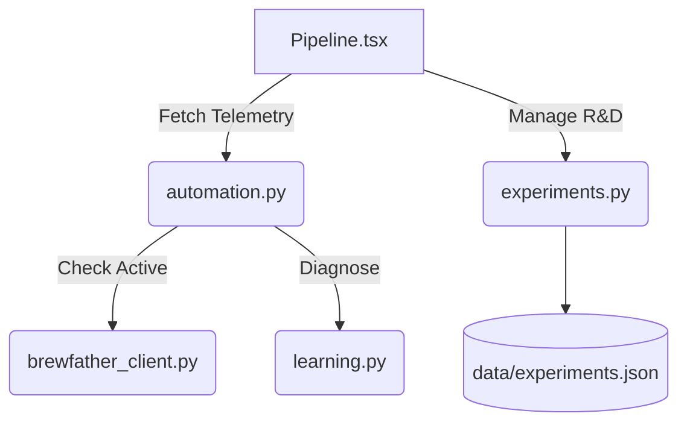

# Pipeline (R&D & Telemetry)

The Pipeline is a core component of Brew Brain's automation stack. It bridges live fermentation tracking with a robust R&D Experiment Tracker.

## Features

### 1. Live Telemetry
- **Scan Active Batches (`POST /api/automation/monitoring/scan`)**: Polls the Brewfather API and local caches to find actively fermenting batches, returning their telemetry (Gravity, Temp) and running them through the local ML stability analyzer.
- **Deep-Dive Diagnostics (`POST /api/automation/alerts` & `POST /api/automation/brewfather/analyze`)**: Allows manual analysis of CSV logs or Brewfather batch IDs. Uses the AI prediction models to determine standard deviation limits and flags anomalies (e.g., ±0.5°C variations).

### 2. Experiment Tracker (Timeline / Gantt View)
- Tracks R&D experiments using a JSON store (`data/experiments.json`).
- Visualizes experiments on a Gantt chart based on their `start_date` and `end_date`.
- **Endpoints**:
  - `GET /api/automation/experiments`: Lists all experiments.
  - `POST /api/automation/experiments`: Creates a new experiment.
  - `PUT /api/automation/experiments/<id>`: Modifies an experiment (status, dates, results).
  - `DELETE /api/automation/experiments/<id>`: Removes an experiment.

## Architecture

## Setup & Testing
1. Ensure the Brewfather API keys are configured in `.env`.
2. Ensure the Flask backend is running.
3. Access the Pipeline via the Automation -> Pipeline tab in the UI.
