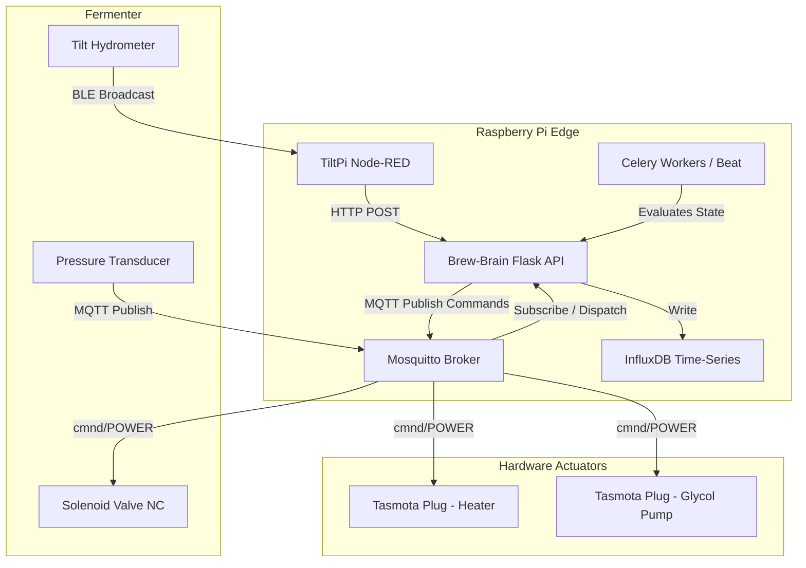
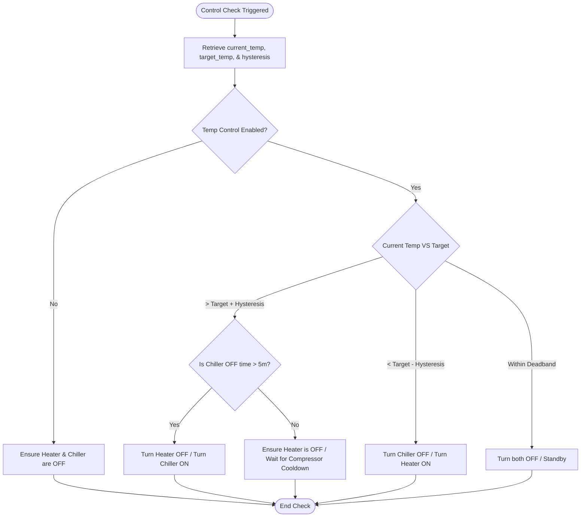
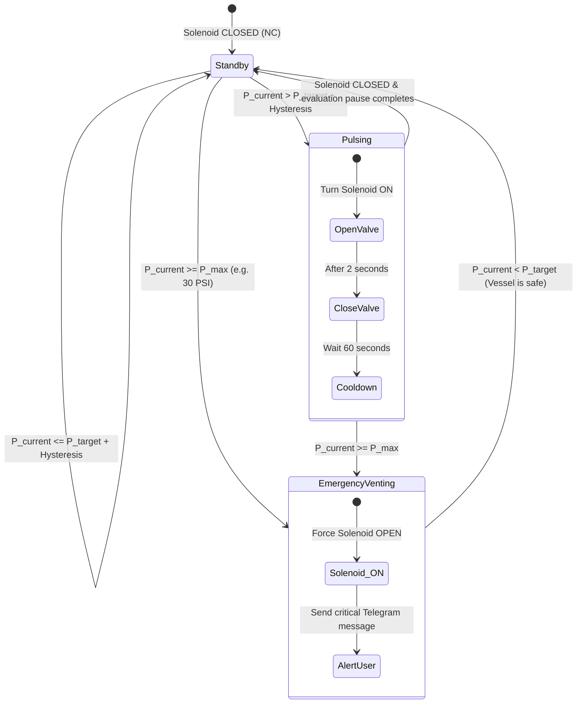

# Brew-Brain Phase 2 Plan: DIY Temperature & Pressure Control
**Author:** Senior Principal Engineer  
**Status:** Proposal / Draft  
**Target File Path:** `docs/plans/phase2/01-diy-control.md`

## 1. Driving Goals & Motivation

The primary objective of Phase 2 is to transform Brew-Brain from a passive telemetry dashboard into an active, closed-loop fermentation controller. By leveraging low-cost, local-first IoT protocols, homebrewers can achieve commercial-grade fermentation precision without relying on expensive, proprietary hardware ecosystems.

### 1.1 Core Objectives
- **Dynamic Temperature Trajectory**: Eliminate manual temperature controller adjustments (e.g., Inkbird) by executing pre-programmed fermentation profiles (heating/cooling phases) based on time, gravity, or yeast velocity.
- **Natural Carbonation via Automated Spunding**: Programmatically control a solenoid valve to trap natural CO2 at the tail-end of fermentation. This carbonates the beer to exact volumes, preserves volatile hop aromas, reduces CO2 tank usage, and prevents oxidation.
- **Edge-First Local Autonomy**: All control loops run entirely on the local Raspberry Pi. In the event of an internet outage, MQTT communications and control logic continue uninterrupted.
- **Micro-Actuation and Overshoot Mitigation**: Prevent yeast thermal shock and compressor short-cycling by implementing intelligent deadbands, hysteresis, and minimum-on/off-time protections.

---

## 2. Detailed Functional Specifications

### 2.1 Closed-Loop Temperature Control

The temperature control subsystem monitors active telemetry from the TiltPi (`TILT_STATE` in memory or InfluxDB) and commands heating/cooling appliances via MQTT.

```
                  +--------------------------------+
                  |    TiltPi Node-RED Gateway     |
                  +---------------+----------------+
                                  |
                                  | (REST poll every 15s)
                                  v
                  +---------------+----------------+
                  |       Brew-Brain Core          |
                  |     (services/controller.py)    |
                  +---------------+----------------+
                                  |
                                  | (MQTT Publish)
                                  v
                    +-------------+-------------+
                    |    Local MQTT Broker      |
                    |       (Mosquitto)         |
                    +------+-------------+------+
                           |             |
           (cmnd/POWER)    v             v    (cmnd/POWER)
             +-------------+---+     +---+-------------+
             | Tasmota Smart   |     | Tasmota Smart   |
             | Plug (Heater)   |     | Plug (Chiller)  |
             +-----------------+     +-----------------+
```

#### Telemetry Inputs
- **Primary Temp Sensor**: Tilt Hydrometer temperature data (resident in `TILT_STATE` or queried from InfluxDB).
- **Secondary / Backup Probe**: Local DS18B20 1-wire probe connected to Raspberry Pi GPIO pin 4 (falls back if Tilt signal is lost for > `tilt_timeout_min`).

#### Actuators
- **Heater**: Tasmota smart plug or ESP32 relay module controlling a heating wrap/belt.
  - MQTT Topic: `cmnd/tasmota_heater/POWER`
  - Payloads: `ON`, `OFF`
- **Cooler**: Tasmota smart plug or ESP32 relay module controlling a glycol pump or refrigerator compressor.
  - MQTT Topic: `cmnd/tasmota_chiller/POWER`
  - Payloads: `ON`, `OFF`

#### Hysteresis & Control Algorithm
To prevent short-cycling and relay degradation, the controller runs a check every 30 seconds with the following constraints:
1. **Deadband**: Target temp $T_{\text{target}}$ with hysteresis $H$ (default: $\pm0.2^\circ\text{C}$).
2. **Compressor Delay**: The chiller relay has a minimum off-time ($t_{\text{off\_min}}$) of 5 minutes before it can be turned back ON.
3. **Logic Flow**:
   - If $T_{\text{current}} > T_{\text{target}} + H$:
     - Turn **Heater** `OFF` immediately.
     - Turn **Chiller** `ON` (subject to $t_{\text{off\_min}}$ check).
   - If $T_{\text{current}} < T_{\text{target}} - H$:
     - Turn **Chiller** `OFF` immediately.
     - Turn **Heater** `ON`.
   - If $T_{\text{target}} - H \le T_{\text{current}} \le T_{\text{target}} + H$:
     - Turn **Heater** `OFF`.
     - Turn **Chiller** `OFF` (to prevent constant micro-toggling).

---

### 2.2 Fermentation Temperature Profiles

Instead of holding a single static temperature, users can configure multi-step profiles that automatically transition based on fermentation metrics.

#### Profile Steps Configuration
A profile contains a list of sequentially executed steps. Each step defines:
- `step_name` (e.g., "Active Fermentation", "Diacetyl Rest", "Cold Crash")
- `target_temp` (float, in °C)
- `ramp_rate` (float, in °C per hour; `0` for step-change)
- `transition_type` (Enum: `time`, `gravity`, `velocity`)
- `transition_value` (float, e.g., hours for `time`, SG for `gravity`, SG/day for `velocity`)

#### Dynamic Ramping Logic
When transitioning from Step $N$ (target $T_A$) to Step $N+1$ (target $T_B$) with ramp rate $R$:
- If $R > 0$, the controller calculates the setpoint dynamically:
  $$T_{\text{set}}(t) = T_A + \text{sign}(T_B - T_A) \cdot \min(|T_B - T_A|, R \cdot \Delta t)$$
  where $\Delta t$ is the time elapsed since the transition started.

#### Transition Trigger Checks
- **Time-based**: Evaluates if the current step duration exceeds `transition_value` hours.
- **Gravity-based**: Evaluates if the latest calibrated SG reading falls below `transition_value`.
- **Velocity-based**: Evaluates if the 24-hour gravity velocity (calculated via `features.calculate_sg_velocity`) drops below `transition_value` (e.g., `< 0.001 SG/day`, signaling active fermentation has ceased, triggering the diacetyl rest).

---

### 2.3 Automated Spunding Control

Spunding regulates vessel pressure during fermentation to carbonate the beer naturally. An electronic spunding valve replaces mechanical diaphragm valves.

#### Telemetry Inputs
- **Pressure Transducer**: 0–30 PSI (or 0-1.2V analog out to ESP32 ADC) sending telemetry via MQTT.
  - MQTT Topic: `tele/brewbrain/fermenter/pressure`
  - Payload Schema: `{"pressure_psi": 12.4, "temp_c": 18.5}`

#### Actuators
- **Solenoid Valve**: 12V/24V Normally Closed (NC) stainless steel solenoid valve connected to an ESP32 relay pin.
  - MQTT Command Topic: `cmnd/brewbrain/solenoid/POWER`
  - MQTT State Topic: `stat/brewbrain/solenoid/POWER`
  - Payloads: `ON` (valve open, venting), `OFF` (valve closed, trapping pressure)

#### Dynamic Carbonation Math
Rather than keeping pressure at a static PSI, Brew-Brain dynamically adjusts the target pressure based on the current beer temperature to match the desired volumes of CO2 dissolved.

Using the Henry's Law CO2 solubility formula:
$$P_{\text{target\_psi}} = -14.67 - 0.0101 \cdot T_F + 0.00418 \cdot T_F^2 + (3.0878 + 0.0894 \cdot T_F - 0.00068 \cdot T_F^2) \cdot V_{\text{CO2}}$$

Where:
- $T_F = (T_{\text{current\_c}} \cdot 1.8) + 32$ (Temperature in Fahrenheit)
- $V_{\text{CO2}}$ = Target Carbonation Volume (e.g., `2.4` volumes of CO2)
- $P_{\text{target\_psi}}$ = Calculated gauge pressure target (PSI)

#### Venting Control Loop Logic
To prevent venting foam/krausen, the valve is operated in pulses:
- If $P_{\text{current}} > P_{\text{target}} + P_{\text{hysteresis}}$ (e.g., target + 0.5 PSI):
  - Pulse the solenoid `ON` for **2 seconds**, then return to `OFF`.
  - Pause the control loop for **60 seconds** to allow the pressure to stabilize and prevent foaming.
- If $P_{\text{current}} \le P_{\text{target}}$:
  - Keep solenoid `OFF`.
- **Safety Override**: If $P_{\text{current}} \ge \text{max\_safe\_pressure\_psi}$ (e.g., `30 PSI`), force the solenoid `ON` (venting) and dispatch an immediate Telegram critical alert.

---

## 3. System Architecture & Flow Diagrams

### 3.1 Hardware & Telemetry Topology

The following diagram outlines the logical connection between the sensors, the edge compute hub, and physical actuators.



### 3.2 Temperature Control Loop Flow

This flowchart illustrates the decision matrix for the temperature control loop executed every 30 seconds.



### 3.3 Dynamic Spunding Control State Machine

This state machine controls the venting and safety parameters of the pressurized fermentation vessel.



---

## 4. Proposed Modules Breakdown

To support DIY control, the backend codebase will be expanded with the following modules:

### 4.1 `app/services/mqtt.py`
Establishes the persistent background connection to the Mosquitto MQTT Broker.
- **Functions**:
  - `init_mqtt(app)`: Initializes the Paho MQTT client using Flask configurations.
  - `publish_message(topic, payload, retain=False)`: Publishes commands.
  - `on_message_callback()`: Handlers for subscribing to `tele/brewbrain/fermenter/pressure` and `stat/+/POWER` to keep in-memory status updated.

### 4.2 `app/services/controller.py`
Executes the closed-loop automation calculations.
- **Classes**:
  - `TemperatureController`: Fetches current temperature, evaluates against target, applies hysteresis, checks compressor timers, and commands heater/cooler Tasmota devices.
  - `SpundingController`: Computes Henry's Law target pressure, compares against incoming pressure telemetry, and issues the pulsed/safety open commands to the venting solenoid.

### 4.3 `app/services/profiles.py`
Manages profile configurations and active step execution.
- **Functions**:
  - `get_active_profile_target_temp(batch_id)`: Inspects active steps, computes current target temperature (handling linear interpolation ramps).
  - `evaluate_profile_transitions(batch_id)`: Checks duration, calibrated SG values, and gravity velocity to auto-advance to the next fermentation step.

### 4.4 Config Additions (`app/core/config.py`)
Add fields to `BrewBrainConfig` to store credentials and settings:

```python
# MQTT Broker Config
mqtt_broker: str = "localhost"
mqtt_port: int = 1883
mqtt_user: str = ""
mqtt_password: str = ""

# Temperature Controller Configuration
temp_control_enabled: bool = False
temp_hysteresis: float = 0.2
min_compressor_rest_minutes: int = 5
temp_control_target_source: str = "static" # "static" or "profile"

# Spunding Configuration
spunding_enabled: bool = False
target_co2_volumes: float = 2.4
max_safe_pressure_psi: float = 30.0
pressure_hysteresis: float = 0.5
```

---

## 5. Integration Points & API Contracts

### 5.1 Database Schema Extensions (InfluxDB)

To support diagnostic charts and performance audits, the controllers will record parameters to InfluxDB.

#### Measurement: `pressure_telemetry`
- **Tags**: `fermenter_id`, `batch_name`
- **Fields**: `pressure_psi` (float), `temp_c` (float)

#### Measurement: `controller_events`
- **Tags**: `device_name` (`heater`, `cooler`, `solenoid`), `trigger_type` (`hysteresis`, `safety`, `manual_override`)
- **Fields**: `state` (integer, `0` for OFF, `1` for ON)

#### Measurement: `control_targets`
- **Tags**: `batch_name`
- **Fields**: `target_temp_c` (float), `target_pressure_psi` (float)

---

### 5.2 API Contracts

#### `GET /api/control/status`
Returns real-time diagnostics for the controllers and actuators.
- **Response (200 OK)**:
```json
{
  "status": "success",
  "temperature_control": {
    "enabled": true,
    "current_temp": 19.3,
    "target_temp": 19.5,
    "hysteresis": 0.2,
    "mode": "profile",
    "active_step": "Active Fermentation",
    "heater_state": "OFF",
    "chiller_state": "OFF",
    "compressor_cooldown_remaining_seconds": 0
  },
  "pressure_control": {
    "enabled": true,
    "current_pressure_psi": 14.2,
    "target_pressure_psi": 13.8,
    "target_co2_volumes": 2.4,
    "solenoid_state": "OFF"
  }
}
```

#### `POST /api/control/manual`
Manual override endpoint to control relays directly (useful for cleaning, sanitizing, or pressure tests).
- **Request**:
```json
{
  "target": "heater", 
  "state": "ON"
}
```
- **Response (200 OK)**:
```json
{
  "status": "success",
  "message": "Manual override command sent: heater ON"
}
```

#### `POST /api/control/profiles/activate`
Binds an existing temperature profile to the active batch.
- **Request**:
```json
{
  "profile_id": "clean_ale_profile",
  "batch_id": "batch_123_neipa"
}
```
- **Response (200 OK)**:
```json
{
  "status": "success",
  "message": "Profile 'clean_ale_profile' activated for batch 'batch_123_neipa'."
}
```

---

### 5.3 Frontend Settings UI Integration
The React dashboard will be expanded with a dedicated **Control Settings** tab in `SettingsPage`.
- **Relay Configuration**: Toggles to enable/disable temperature and spunding control.
- **MQTT Setup Form**: Inputs for broker host, port, username, password, and topic prefixes.
- **Profile Creator**: Drag-and-drop builder to set up steps, ramp velocities, and triggers. Includes a visual timeline showing gravity-based transition points.
