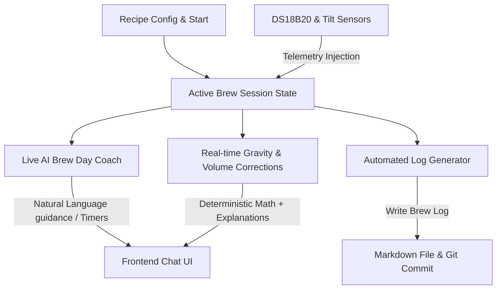

# Brew-Brain Phase 2: AI-Assisted Brew Day Coaching & Live Adjustments

This document outlines the Product Requirements and Technical Architecture for Phase 2 of the Brew-Brain project. This stream introduces real-time, context-aware AI coaching during the brew day, deterministic gravity/volume corrections, and automated markdown log generation.

---

## 1. Assumptions & Constraints

Before outlining the technical plan, the following architectural assumptions are established:
1. **Edge AI Hardware Limits**: The local LLM is hosted via Ollama on a Raspberry Pi 5 (8GB RAM). Due to CPU/RAM constraints, we target quantized models (e.g., `llama3:8b` or `phi3:3.8b`) and enforce strict resource waste management (unloading models via `"keep_alive": 0` or a short session-bound TTL).
2. **Deterministic Calculations**: AI must **never** compute raw dilution, DME additions, or IBU math. The LLM will orchestrate and explain corrections, but the mathematical calculations are executed by deterministic Python functions.
3. **Session Persistence**: Active brew day states (current step, timers, logged telemetry) are stored in a lightweight, file-backed JSON session state (`data/active_brew_session.json`) rather than InfluxDB to avoid polluting time-series schemas.
4. **Sensor Inputs**: Mash temperatures are pulled from 1-wire DS18B20 probes, and fermentation telemetry uses Tilt hydrometers. Wort volumes are entered manually by the user or derived from recipe specifications.

---

## 2. Driving Goals

The implementation of Phase 2 is driven by three main goals:
* **Reduce Cognitive Load**: Brew days are chaotic, time-sensitive environments. An interactive coach keeps the brewer on track with mash rests, sparging steps, and boil additions without requiring them to check paper recipes or separate timer apps.
* **Precision Recovery (Zero Ruined Batches)**: Missed mash efficiency or incorrect boil-off rates lead to off-target gravity. Automating dilution and DME calculations reduces manual calculation errors when stress is high.
* **Seamless Documentation**: Brewers frequently neglect logging details due to the manual overhead. Automatically generating structured markdown logs saves time and ensures an accurate historical record of brew day deviations.

---

## 3. Functional Specifications



### 3.1 Live AI Brew Day Coach
The Coach guides the user through the chronological phases of a brew day (Setup, Strike, Mash, Sparge, Boil, Knockout).
* **Step-by-Step State Machine**: Tracks the active phase. Transitions occur via user confirmation ("Mash finished") or automated triggers (e.g., "Mash temp stabilized at 65°C for 60 mins").
* **Interactive Conversational UI**: Implemented via a persistent chat panel. The user can ask questions such as:
  * *"I'm mashing in, what's my target temperature again?"*
  * *"Should I adjust my flow rate for recirculating?"*
* **Hop & Fining Additions Alarms**: Background timers trigger alerts when additions are due.
  * **Alert Structure**: 
    * 60 mins: Magnum (Bittering)
    * 15 mins: Yeast Nutrient + Whirlfloc
    * 0 mins: Flameout flame-off, begin whirlpool

### 3.2 Real-Time Gravity & Volume Corrections
When the brewer measures specific gravity or volume and misses the target, the corrections engine computes interventions.

#### Pre-Boil Gravity Corrections
* **Scenario A: Gravity is Low (Mash efficiency missed)**
  Calculate required Dry Malt Extract (DME) addition:
  $$DME_{\text{added}} \text{ (grams)} = \frac{(SG_{\text{target}} - SG_{\text{measured}}) \times V_{\text{measured}} \times 1000}{0.375}$$
  *(Where $0.375$ is the extract potential of DME in liter-gravity points per gram).*
* **Scenario B: Gravity is High (Under-volume or high efficiency)**
  Calculate required dilution water to hit target pre-boil gravity:
  $$V_{\text{dilution}} \text{ (Liters)} = \left( \frac{SG_{\text{measured}} - 1.0}{SG_{\text{target}} - 1.0} \times V_{\text{measured}} \right) - V_{\text{measured}}$$

#### Post-Boil / Knockout Corrections
* **Scenario C: Knockout Gravity is High**
  Calculate top-up water to hit target Original Gravity (OG) in the fermenter:
  $$V_{\text{top-up}} \text{ (Liters)} = \left( \frac{OG_{\text{measured}} - 1.0}{OG_{\text{target}} - 1.0} \times V_{\text{measured}} \right) - V_{\text{measured}}$$

### 3.3 Automated Log Generation
At session completion, the system aggregates all captured events into a structured Markdown document saved under `data/logs/brew_days/`.
* **Captured Events**: Timestamped sensor telemetry, target vs. actual values, user chat transcripts, and corrections applied.
* **AI Analysis**: The local LLM processes the log metadata and writes a brief "Brewmaster's Evaluation" detailing mash efficiency, temperature stability, and recommendations for the next brew day.

---

## 4. Prompt Engineering & Context Injection

To generate context-aware coaching advice without exceeding the Raspberry Pi's memory, we construct highly structured, token-efficient prompts.

### 4.1 Context Payload Structure
The API compiles the following JSON state to inject into the LLM system prompt context:

```json
{
  "recipe": {
    "name": "Hazy Pale Ale v061225",
    "target_og": 1.054,
    "target_volume_l": 20.0,
    "mash_steps": [{"temp_c": 66.0, "duration_min": 60}],
    "hop_schedule": [{"name": "Citra", "weight_g": 50, "time_min": 10}]
  },
  "yeast": {
    "name": "Lallemand Verdant IPA",
    "ideal_temp_min": 18.0,
    "ideal_temp_max": 23.0
  },
  "current_state": {
    "phase": "boil",
    "step_elapsed_min": 45,
    "measured_pre_boil_sg": 1.048,
    "target_pre_boil_sg": 1.048
  },
  "live_telemetry": {
    "kettle_temp_c": 99.8,
    "ambient_temp_c": 19.5
  }
}
```

### 4.2 Prompt Templates

#### Active Coaching Prompt
```text
System: You are the Brew-Brain Active Brew Day Coach. You assist the brewer step-by-step.
Your tone is highly technical, concise, and professional. 
Never hallucinate values. If data is missing, request clarification.

Current Session Context:
{context_json}

User Message: {user_message}

Instruction: Provide a response of maximum 3 sentences. Focus strictly on the current brew day phase, safety precautions, or upcoming additions.
```

#### Correction Orchestration Prompt
```text
System: You are the Brew-Brain Diagnostics Engineer. The brewer has missed their gravity target.
A physical calculation has computed the following correction parameters:
- Measured SG: {measured_sg}
- Target SG: {target_sg}
- Measured Volume: {measured_volume} L
- Recommended Addition: {correction_action} (e.g., Add 450g DME or Add 2.3L water)

Instruction: Explain to the brewer why this correction is necessary and the physical impact of making this adjustment on yeast health and hop utilization. Keep it under 4 sentences. Do not perform the math yourself; explain the calculated result.
```

### 4.3 Pi Memory Optimization
* **TTL-Based Keep-Alive**: Set `"keep_alive": "30m"` during an active brew session to prevent the overhead of reloading the model every time the user advances a step. 
* **Model Unloading**: Automatically trigger a call with `"keep_alive": 0` once the brew day session is ended or goes inactive for more than 45 minutes.

---

## 5. Proposed Modules Breakdown

### 5.1 Backend Service Layer (`app/services/`)

* **`brewday_coach.py`**:
  * **Class `BrewSessionManager`**: Manages initialization, active steps, state transitions, and step timers. Saves state dynamically to `data/active_brew_session.json`.
* **`brew_math.py`**:
  * **Function `calculate_dme_addition(measured_sg, target_sg, volume_l) -> float`**
  * **Function `calculate_dilution_water(measured_sg, target_sg, volume_l) -> float`**
  * **Function `calculate_boil_extension(measured_sg, target_sg, volume_l, boil_off_rate) -> float`**
* **`brew_logger.py`**:
  * **Function `generate_brew_log(session_data) -> str`**: Formats session telemetry, events, and LLM evaluations into a standardized Markdown template.

### 5.2 Flask API Routes (`app/api/brewday.py`)

* **`POST /api/brewday/start`**:
  * Request payload: `{"recipe_id": "string", "yeast_id": "string"}`.
  * Action: Initializes the session JSON.
* **`POST /api/brewday/action`**:
  * Request payload: `{"message": "string", "action_type": "step_advance | user_chat | timer_event"}`.
  * Action: Updates session state, evaluates timers, and queries the local Ollama LLM with context injection.
* **`POST /api/brewday/correct`**:
  * Request payload: `{"measured_sg": float, "measured_volume": float, "stage": "pre_boil | post_boil"}`.
  * Action: Computes correction value using `brew_math.py`, constructs the correction prompt, queries Ollama, and returns the recommendation.
* **`POST /api/brewday/complete`**:
  * Action: Compiles all event records, calls `brew_logger.py` to write the Markdown file, and clears the active session JSON.

---

## 6. Integration Points & Data Flow

### 6.1 Database & Configuration Store
* **Local Config Store**: Target recipes and yeast properties are pulled from the existing config DB / JSON registry.
* **InfluxDB Integration**: Real-time temperature logs during mashing are query-aggregated (e.g., checking standard deviation of mash temperature) and injected into the final log file summary.

### 6.2 Frontend Next.js Chat UI
* **Chat Integration**: The existing Next.js page at `/chat` will be expanded or duplicated into a dedicated `/brewday` workflow.
* **UI Elements**:
  * **Aesthetic**: Follows the dark-mode glassmorphism system with vibrant accents.
  * **Dashboard Layout**: Side-by-side view with active timers and sensor readings on the left, and the AI coach chat panel on the right.
  * **Correction Modals**: Simple modal prompts when gravity readings deviate from targets, with slider controls showing "Calculated Adjustments" and AI descriptions.

```text
+--------------------------------------------------------------+
| [<- Back]    Brewing: Hazy Pale Ale v061225     [Status: Mash] |
+-------------------------------+------------------------------+
| Telemetry & Timers            | Brewmaster Coach             |
|                               |                              |
| Kettle Temp: 65.4°C [Stable]  | [AI]: Mash temp is holding   |
| Target Temp: 66.0°C           | nicely. Recirculating at     |
|                               | 1.5 L/min is recommended to  |
| Mash Timer: 12:45 / 60:00     | prevent channeling.          |
|                               |                              |
| [ Add Gravity Measurement ]   | User: Recirculation speed ok.|
|                               | [Send]                       |
+-------------------------------+------------------------------+
```
