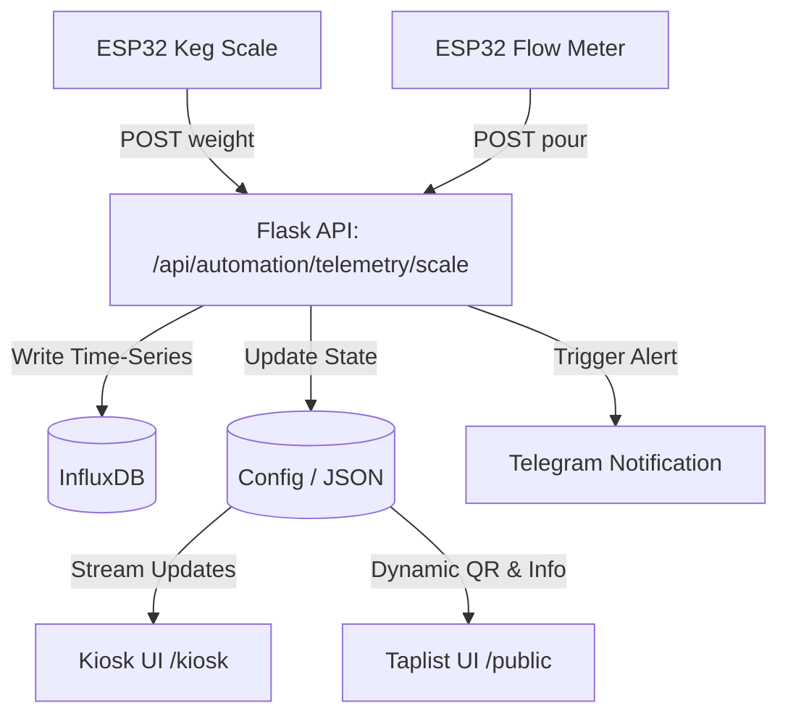

# Brew-Brain Phase 2: DIY Keg Scales & Flow Meters (Taproom Automation)
## Project Stream Document (Module 09)

This document details the architectural design and functional specifications for integrating DIY physical telemetry hardware into the taproom. This moves Brew-Brain from estimated volume-decay logic to real-time, sensor-verified tracking of draft assets.

---

## 1. Driving Goals
The introduction of physical telemetry onto draft lines serves three primary engineering and operational objectives:

1. **Precision Volume Tracking (Zero-Waste Operations):**
   * Eliminate manual tap updates and estimation errors.
   * Provide real-time detection of keg status (e.g., foaming, empty lines, slow leaks).
   * Accurate inventory management with weight-verified yield tracking.

2. **Frictionless Social Check-ins:**
   * Motivate customer/guest engagement by linking physical pours directly to Untappd check-ins.
   * Automatically generate QR check-in flows based on the active batch configuration.

3. **Homelab Hardware Parity:**
   * Extend the ESP32 homelab ecosystem (already tracking fermentation via Tilt/DS18B20) to the serving side.
   * Deliver responsive local dashboards without relying on costly commercial draft tracking systems.

---

## 2. Detailed Functions

### 2.1 Keg Scale Weight Tracking (Real-Time Weight Telemetry)
Each draft tap will support an independent ESP32-controlled scale placed underneath the keg.

* **Hardware Architecture:**
  * **Microcontroller:** ESP32 (NodeMCU or custom PCB) with built-in Wi-Fi and low-power sleep modes.
  * **Sensors:** Four 50kg load cells in a Wheatstone bridge configuration per keg scale (total 200kg capacity, protecting against shock loads during keg changes).
  * **ADC:** HX711 24-bit analog-to-digital converter, configured for 10Hz sampling.
  * **Power:** 5V Micro-USB or rechargeable 18650 Li-Ion battery (utilizing deep sleep between transmission cycles).
* **Calibration & Physics Engine:**
  * **Tare Weight (Empty Keg):** A standard 19L Corny Keg has an empty weight of approximately $4.2 \text{ kg} \text{ to } 5.0 \text{ kg}$. The tare offset is configured in the admin UI per tap.
  * **Density Calibration (Specific Gravity Compensation):** 
    $$\text{Volume Remaining (L)} = \frac{\text{Measured Weight (kg)} - \text{Tare Weight (kg)}}{\text{Specific Gravity}}$$
    The system reads the active batch's Final Gravity (FG) from the tap list config (e.g., $1.012 \text{ kg/L}$) to dynamically convert weight into precise remaining volume.
  * **Zero-Drift Filtering:** A rolling median filter (kernel size 5) runs on the ESP32 to prevent transient vibration or pressure spikes from triggering false readings.

### 2.2 Inline Flow Meter Tracking (Precise Pour Metrics)
To measure volume-decay in real-time, food-grade flow sensors are installed in-line between the keg out-coupler and the tap faucet.

* **Hardware Architecture:**
  * **Sensors:** Food-grade G1/4" Hall-effect flow meters (e.g., YF-S401 or equivalent) with high pulse-per-liter resolution.
  * **Wiring:** 10k$\Omega$ pull-up resistor on the signal line, connected to an ESP32 hardware interrupt GPIO pin.
* **Firmware & Edge Logic:**
  * **Pulse Counting:** Utilizes hardware interrupts on the ESP32.
  * **K-Factor Calibration:** The conversion factor (pulses per Liter) is calibrated in settings. A default of $5880 \text{ pulses/L}$ is assumed for YF-S401.
  * **Pour Event Detection:** 
    * When pulses are detected, a pour event is declared active.
    * A minimum threshold of $15\text{ml}$ is required to filter out pressure-pulse noise.
    * When no pulses are detected for $3\text{ seconds}$, the pour is considered complete, and the total pulse count is transmitted to the server.
    * Local buffer in RAM handles network drop retries.

### 2.3 Untappd Social Check-in Integration
Automates checking in and logging feedback.

* **Dynamic QR Routing:**
  * The system pulls the `untappd_url` from the tap configuration (either scraped using SerpAPI or set manually).
  * If `untappd_url` is configured, the `/taps` API generates a QR code pointing directly to the Untappd check-in URL.
  * If not configured, it generates a QR code routing to the local public tap info page (`/public/tap/<tap_id>`).
* **Pour Event Social Webhooks:**
  * A completed pour event can optionally trigger a webhook to log check-in metrics on a local dashboard or broadcast to Telegram:
    * *"Someone just poured a Pint of Hazy Pale (6.2% ABV) on Tap 2!"*

---

## 3. Telemetry API Endpoints & Schemas

To ingest data from ESP32 clients, two new endpoints will be exposed on the Brew-Brain Flask backend under the `/api/automation` blueprint. All requests must provide the API token in the `Authorization` header.

### 3.1 Keg Scale Telemetry
* **Endpoint:** `POST /api/automation/telemetry/scale`
* **Headers:** `Authorization: Bearer <secure_token>`
* **Request Schema:**
```json
{
  "tap_id": "tap_1",
  "sensor_id": "scale_esp32_ab45",
  "raw_value": 8388607,
  "weight_kg": 24.12,
  "battery_v": 4.15,
  "rssi": -68
}
```
* **Processing Logic:**
  1. Authenticate token.
  2. Validate payload schema.
  3. Fetch the configuration for `tap_id` (via `get_config("taps")`).
  4. Perform tare subtraction and density calculation to derive the remaining percentage.
  5. Write scale data to InfluxDB:
     * **Measurement:** `keg_scale_readings`
     * **Tags:** `tap_id`, `sensor_id`
     * **Fields:** `raw_value`, `weight_kg`, `battery_v`, `rssi`, `volume_remaining_ml`, `remaining_pct`

### 3.2 Flow Meter Pour Telemetry
* **Endpoint:** `POST /api/automation/telemetry/flow`
* **Headers:** `Authorization: Bearer <secure_token>`
* **Request Schema:**
```json
{
  "tap_id": "tap_1",
  "sensor_id": "flow_esp32_cd89",
  "pour_id": "abc-123-xyz",
  "pulse_count": 3340,
  "volume_ml": 568.0,
  "duration_sec": 12.4
}
```
* **Processing Logic:**
  1. Authenticate token.
  2. Validate payload schema.
  3. Fetch active tap config and decrement the keg's `volume_remaining_ml` by `volume_ml` (leveraging `pour_tap(tap_id, volume_ml)`).
  4. Write pour event data to InfluxDB:
     * **Measurement:** `flow_meter_readings`
     * **Tags:** `tap_id`, `sensor_id`, `pour_id`
     * **Fields:** `pulse_count`, `volume_ml`, `duration_sec`
  5. If the volume reduction drops below the alert threshold (e.g., $10\%$), trigger a Telegram alert.

---

## 4. Proposed Modules Breakdown

The features will be organized into clean modular service blocks within the existing backend structure:

```
app/
├── api/
│   ├── telemetry_receiver.py     # Ingests scale/flow posts, validates payload schema
│   └── untappd.py                # Handles Untappd scraping and URL generation
├── services/
│   ├── scale_processor.py        # Tare, density, temperature-drift calculations
│   ├── flow_manager.py           # Processes pour updates, handles local buffers
│   └── taps.py                   # Updates current volume, handles manual overrides
└── core/
    └── influx.py                 # Handles InfluxDB client connection pools
```

### 4.1 `telemetry_receiver.py` (API Blueprint)
Handles input routing, parsing payload schemas, and authenticating nodes. It validates limits (e.g., ensuring weight doesn't go negative) before passing data to services.

### 4.2 `scale_processor.py` (Weight Services)
* **Zero-Drift Compensation:** Compensates for slow calibration changes due to environmental changes (temperature or humidity shifts in the kegerator).
* **Tare Wizard:** Provides an endpoint to zero-out the scale with an empty keg in place.

### 4.3 `flow_manager.py` (Flow Services)
* **Pour Reconciliation:** Matches flow-meter readings with scale weight drop to verify telemetry. If a flow-meter reports a pour of $500\text{ml}$ but the scale drops by $5\text{kg}$, the system logs a telemetry variance alert.

---

## 5. Integration Points



### 5.1 `/kiosk` UI Enhancements
* **Pour Animation Overlay:** When a flow sensor starts pulsing, the Kiosk UI (which polls every 60s or consumes WebSockets) receives a broadcast event and shows a visual overlay: *"Pouring Tap 2..."* with a live-filling glass animation.
* **Alert States:** If a scale reports rapid weight decay without a corresponding flow meter pulse, the tap tile changes to "Warning" (Brewery Red) to flag a potential draft line leak.

### 5.2 Taplist UI Enhancements
* **Check-In QR Codes:** Displays the dynamically generated base64-encoded QR code on Tap cards. Customers scan the QR code to open the beer on Untappd and submit check-ins.
* **Volume Ring Gauge:** Uses a styled SVG ring around the beer icon to show the exact volume remaining, replacing the standard step-down progress bars.

---

## 6. Implementation Risks & Mitigations

| Risk | Impact | Mitigation Strategy |
| :--- | :--- | :--- |
| **Scale Drift / Moisture:** | Innaccurate keg level readings over time due to high humidity inside the kegerator. | Implement high-quality conformal coating on load cells and HX711 boards. Run auto-calibration logic when a keg is disconnected (detected via weight dropping below $0.5 \text{ kg}$). |
| **Flow Pulse Noise:** | False pour events triggered by CO2 pocket bubbles or line pressure shifts. | Enforce minimum pour thresholds ($15\text{ml}$) and pulse validation in the ESP32 firmware before making API calls. |
| **Network Latency:** | Delayed updates in the `/kiosk` view. | Leverage Eventlet-based WebSockets for real-time pour events, falling back to 10-second polling for active pouring states. |
