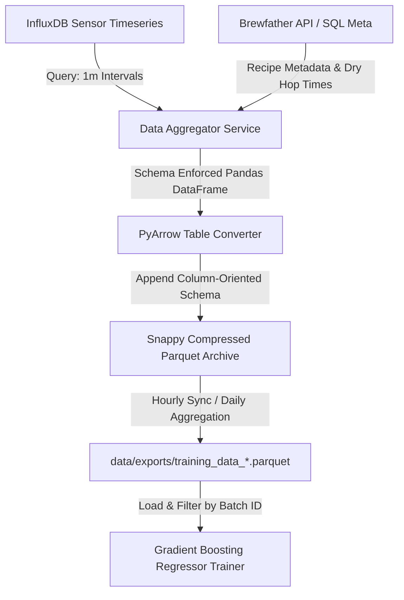

# Project Stream Plan: Advanced Fermentation Prediction Modeling (Phase 2)

## 1. Driving Goals
The core objective of Phase 2 modeling is to shift Brew-Brain from reactive monitoring to proactive, high-precision fermentation forecasting. The driving goals include:

*   **Reduce Tank Occupancy Uncertainty:** Refining time-to-FG (Final Gravity) predictions down to a $\pm 12\text{-hour}$ window, allowing breweries to optimize cellaring schedules and dry-hop/packaging timelines.
*   **Prevent Fermentation Stalls:** Early detection of sluggish fermentations by modeling kinetic deviations in the first 24–48 hours against historical baselines.
*   **Model Yeast Health Dynamics:** Incorporating pitch size, viability decay (yeast age), and starter propagation characteristics into the primary machine learning regressors to account for kinetic variance across different pitches of the same yeast strain.
*   **Manage Dry-Hop Creep:** Predicting secondary enzymatic fermentation (hop creep) triggered by dry-hop additions, preventing over-attenuation, diacetyl spikes, and unexpected carbonation issues in packaged beer.
*   **Provide Style-Specific Kinetic Baselines:** Matching active batches to historical profiles using multi-batch cross-correlation to warn brewers when a fermentation behaves atypically for its style or yeast strain.

---

## 2. Detailed Functions

### 2.1 Yeast Pitching Rate Modeling
Yeast vitality and quantity are the primary drivers of the fermentation lag phase and initial attenuation rate. Phase 2 introduces a dedicated feature extractor to quantify these factors before feeding data to the Gradient Boosting regressor.

*   **Feature Expansion:**
    *   `pitch_cells_ml`: Million cells pitched per milliliter of wort (target: $0.75 \times 10^6\text{ cells/ml/}^{\circ}\text{Plato}$ for ales, $1.5 \times 10^6$ for lagers).
    *   `yeast_age_days`: Time elapsed since the yeast package manufacturing date or harvesting date. Used to compute viability decay using an exponential decay curve:
        $$\text{Viability (\%) } = 100 \times e^{-\lambda \times t}$$
        where $\lambda \approx 0.008$ for liquid yeast slurry stored at $4^\circ\text{C}$ (approx. $20\%$ loss per month).
    *   `is_starter`: Boolean indicating if a yeast starter was propagated.
    *   `starter_volume_liters`: Volumetric size of the starter.
    *   `starter_steps`: Integer count of step-ups performed during starter propagation.
    *   `generation`: Yeast generation count (serial repitching tracking).
*   **Integration with Gradient Boosting Regressor:**
    *   These features are normalized and appended to the existing input matrix $X$ (which currently includes `og_normalized`, `velocity_normalized`, `temp_normalized`, `temp_variance`, `style_code`, and `yeast_code`).
    *   The model learns to map lower viability and pitching rates to extended lag phases and higher terminal gravity (under-attenuation).

### 2.2 Dry-Hop Creep Predictor
Dry hopping introduces endogenous diastatic enzymes (amlyoglucosidase, $\alpha$-amylase, $\beta$-amylase, and limit dextrinase) from hop material into the wort. These enzymes break down unfermentable dextrins into fermentable simple sugars, restarting fermentation.

*   **Creep Signature Detection:**
    *   The model monitors the specific gravity (SG) slope (velocity) after terminal gravity (TG) has theoretically been reached.
    *   A secondary downward shift in SG ($<-0.001\text{ SG/day}$) accompanied by a mild temperature increase or pH drop indicates active hop creep.
*   **Predictive Adjustments:**
    *   **Input Features:**
        *   `dry_hop_dosage_g_l`: Dry-hop mass in grams per liter of wort.
        *   `dry_hop_temp`: Temperature during dry hopping (warm dry hop at $15\text{--}20^\circ\text{C}$ vs. cold dry hop at $0\text{--}4^\circ\text{C}$).
        *   `dry_hop_timing_days`: Fermentation day when dry hops are added.
        *   `hop_variety_enzymatic_index`: Categorical lookup representing enzymatic strength of specific hop varieties (e.g., Amarillo and Cascade have higher enzymatic activity than target-dosed varieties like Hallertau Mittlefruh).
    *   **Model Adjustments:**
        *   The model adjusts the predicted final gravity downwards (typically by $0.001\text{ to } 0.003\text{ SG}$ points depending on dosage and temperature).
        *   The time-to-FG predictor is extended by a calculated creep duration window (typically $3\text{ to } 5\text{ days}$).

### 2.3 Multi-Batch Cross-Correlation Analysis
This module performs statistical alignment of the active batch’s fermentation curve against historical runs using the same yeast strain or style parameters.

*   **Dynamic Time Warping (DTW) & Cross-Correlation:**
    *   Computes the similarity between the active batch gravity velocity curve ($V_{\text{active}}$) and historical curves ($V_{\text{historic}}$) in the database.
    *   DTW maps temporal shifts in fermentation speed (such as a delayed start due to lower pitch rates), aligning the curves to evaluate overall kinetic shape similarity.
*   **Anomaly & Health Classification:**
    *   A similarity score ($S \in [0, 1]$) is computed.
    *   If $S < 0.70$ compared to the rolling 5-batch average for the yeast strain, the system flags the batch as "Kinetically Anomalous" via `/api/ml/predict` and triggers a system warning.
    *   Allows prediction models to perform k-Nearest Neighbors (k-NN) classification to select the most similar historical runs, weighting their trajectories heavier in the Gradient Boosting prediction.

---

## 3. Data Pipelines and Training Schedules

### 3.1 Pydantic Schemas

```python
from datetime import datetime
from typing import List, Optional, Dict, Any
from pydantic import BaseModel, Field, model_validator

class YeastPitchDetails(BaseModel):
    """Details of the yeast pitch for kinetic modeling."""
    cells_pitch_billions: float = Field(..., description="Total yeast cells pitched in billions", ge=0.0)
    viability_percent: float = Field(default=95.0, description="Estimated viability percentage at time of pitch", ge=0.0, le=100.0)
    yeast_age_days: int = Field(default=0, description="Age of yeast package in days since manufacture or harvest", ge=0)
    generation: int = Field(default=1, description="Yeast generation number (repitch count)", ge=1)
    is_starter: bool = Field(default=False, description="Whether a yeast starter was prepared")
    starter_volume_liters: float = Field(default=0.0, description="Volume of yeast starter in liters", ge=0.0)
    starter_steps: int = Field(default=0, description="Number of propagation steps in the starter", ge=0)

class DryHopAddition(BaseModel):
    """Metadata regarding dry-hop additions to predict hop creep."""
    addition_time_hours: float = Field(..., description="Hours elapsed from pitch before dry hops are added", ge=0.0)
    dosage_g_l: float = Field(..., description="Dry-hop dosage rate in grams per liter", ge=0.0)
    temperature_c: float = Field(..., description="Wort temperature during dry-hop contact time", ge=-5.0, le=35.0)
    hop_variety: str = Field(..., description="Hop variety name for enzymatic activity lookup")
    contact_time_hours: Optional[float] = Field(default=72.0, description="Target contact time in hours", ge=0.0)

class BatchMLFeatures(BaseModel):
    """Combined feature payload for training and batch validation."""
    batch_id: str = Field(..., description="Brewfather or custom system batch identifier")
    batch_name: str = Field(..., description="Name of the batch")
    style: str = Field(..., description="Beer style code or name")
    yeast_strain: str = Field(..., description="Yeast strain identifier")
    og: float = Field(..., description="Original Gravity", ge=1.000, le=1.200)
    fg: Optional[float] = Field(None, description="Actual Final Gravity (known after completion)", ge=0.980, le=1.100)
    pitch_details: YeastPitchDetails = Field(..., description="Yeast Pitch metadata")
    dry_hop_additions: List[DryHopAddition] = Field(default_factory=list, description="Array of dry-hop additions")

class MLTrainingResponse(BaseModel):
    """Response payload detailing results of training model updates."""
    status: str = Field(..., description="Execution status ('success' or 'error')")
    batches_used: int = Field(..., description="Total unique batches incorporated in the model")
    trained_at: datetime = Field(..., description="Timestamp of model training completion")
    fg_mae: float = Field(..., description="Mean Absolute Error for Final Gravity model")
    time_mae_days: float = Field(..., description="Mean Absolute Error for Time-to-FG model in days")
    features_importance: Dict[str, float] = Field(..., description="Dictionary mapping features to relative importances")

class PredictionOutputSchema(BaseModel):
    """Structure returned by prediction queries."""
    batch_id: str = Field(..., description="Identifier of predicted batch")
    predicted_fg: float = Field(..., description="Predicted Final Gravity value")
    predicted_fg_lower_bound: float = Field(..., description="Lower 95% confidence interval SG value")
    predicted_fg_upper_bound: float = Field(..., description="Upper 95% confidence interval SG value")
    days_to_fg: float = Field(..., description="Estimated remaining days until final gravity is reached")
    hop_creep_detected: bool = Field(..., description="Indicates if a hop creep signature has altered the prediction")
    hop_creep_gravity_offset: float = Field(..., description="Gravity offset applied due to expected hop creep")
    correlation_score: float = Field(..., description="Cross-correlation score against top peer batch")
    peer_batch_id: Optional[str] = Field(None, description="ID of the historically matched batch used for reference kinetics")
    updated_at: datetime = Field(..., description="Time of prediction calculation")
```

### 3.2 InfluxDB Parquet Integrations
The training pipeline bridges real-time sensor metrics (stored in InfluxDB) and recipe configuration data (pulled from Brewfather or the local configuration DB).



*   **Pipeline Architecture:**
    1.  **Extraction:** During active fermentation, InfluxDB stores metrics (`Temp`, `SG`, `Pressure`, `pH`) every 1 minute.
    2.  **Synthesis:** At batch completion or periodic checks, the aggregator compiles InfluxDB records, joins them against recipe data matching the Pydantic schema structure, and fills in missing variables (e.g. yeast age, starter parameters).
    3.  **Storage:** The synthetic table is exported using `pyarrow.parquet` with Snappy compression to `data/exports/<batch_id>_<timestamp>.parquet`.
    4.  **Archival:** Historic Parquet data is preserved, while older InfluxDB data is pruned according to the 90-day retention policy to conserve local disk space on the edge device.
*   **Training Schedule:**
    *   **Automatic Trigger:** A background Celery/scheduler task triggers when a batch transitions to "Completed" in Brewfather. This extracts the batch data, converts it to Parquet, and saves it.
    *   **Scheduled Retention Run:** Every Sunday at 02:00 UTC, a system cron job aggregates all individual batch files into `data/exports/training_data_<timestamp>.parquet` and schedules model retraining.
    *   **Alerting Check:** MAE metrics are sent to InfluxDB (`ml_metrics` measurement) to track drift. If MAE exceeds $0.003\text{ SG}$ points, a notification is sent to Grafana to flag model degradation.

---

## 4. Proposed Modules Breakdown

```
app/
├── ml/
│   ├── __init__.py
│   ├── features.py          # Existing extraction helpers (velocity, variance)
│   ├── kinetic_engine.py    # NEW: Yeast Pitching rate modeling & decay logic
│   ├── creep_analyzer.py    # NEW: Hop creep detection & gravity offsets
│   ├── correlation.py       # NEW: DTW & cross-correlation curve mapping
│   ├── prediction.py        # Gradient Boosting training & predictions
│   └── tasks.py             # Background Celery tasks for training
└── api/
    └── ml.py                # REST endpoints serving predictions and trigger controls
```

*   **`kinetic_engine.py`:** Calculates yeast viability curves, validates starting cell count vs. Plato target, and returns normalized kinetic coefficients for pitching.
*   **`creep_analyzer.py`:** Monitors real-time SG slopes for signatures of enzymatic reactivation. Computes predictive offsets based on dry-hop timing and variety indexes.
*   **`correlation.py`:** Computes similarity indexes between active batches and peer records. Handles Dynamic Time Warping comparisons.

---

## 5. Integration Points with Existing ML Routes

### 5.1 Route: `POST /api/ml/train`
Triggers model retraining, incorporating the expanded features (yeast pitching, hop additions, and history profiles) into the pipeline.

*   **Workflow:**
    1.  Validates that all Parquet files in `data/exports/` have the updated structural columns. If missing, applies default values based on yeast strain averages.
    2.  Loads and parses `BatchMLFeatures` records.
    3.  Performs Hyperparameter Tuning (GridSearchCV/RandomizedSearchCV) over expanded parameters (learning rates, max depth, estimators).
    4.  Overwrites `fg_predictor.joblib` and `time_predictor.joblib` upon verification of improved performance metrics.
*   **Response Payload Sample:**
    ```json
    {
      "status": "success",
      "batches_used": 42,
      "trained_at": "2026-05-25T21:10:00Z",
      "fg_mae": 0.0018,
      "time_mae_days": 0.65,
      "features_importance": {
        "og_normalized": 0.42,
        "pitch_cells_ml": 0.18,
        "velocity_normalized": 0.15,
        "dry_hop_dosage_g_l": 0.12,
        "temp_normalized": 0.08,
        "yeast_age_days": 0.05
      }
    }
    ```

### 5.2 Route: `GET /api/ml/predict`
Calculates predictions for the active batch using cached values. Background workers constantly update this cache using the expanded model features.

*   **Workflow:**
    1.  The client requests active batch forecast.
    2.  If the cache `ml_predictions` is missing or expired, the backend returns a `202 Accepted` response and tasks Celery to process.
    3.  The task queries the active batch telemetry from InfluxDB and joins it with recipe metadata.
    4.  Computes cross-correlation against the historical database using `correlation.py`.
    5.  Applies the Gradient Boosting Regressors to predict FG and time-to-FG.
    6.  Detects if dry hops have been added (or are scheduled); if yes, the prediction is passed to `creep_analyzer.py` to offset FG and delay target timelines.
    7.  Serializes output to `PredictionOutputSchema` and populates the Redis/Flask cache.
*   **Cached Data Format Output:**
    ```json
    {
      "status": "success",
      "data": {
        "batch_id": "bf_batch_993a4b",
        "predicted_fg": 1.011,
        "predicted_fg_lower_bound": 1.009,
        "predicted_fg_upper_bound": 1.013,
        "days_to_fg": 3.2,
        "hop_creep_detected": true,
        "hop_creep_gravity_offset": -0.002,
        "correlation_score": 0.89,
        "peer_batch_id": "bf_batch_872c1d",
        "updated_at": "2026-05-25T21:12:00Z"
      }
    }
    ```
